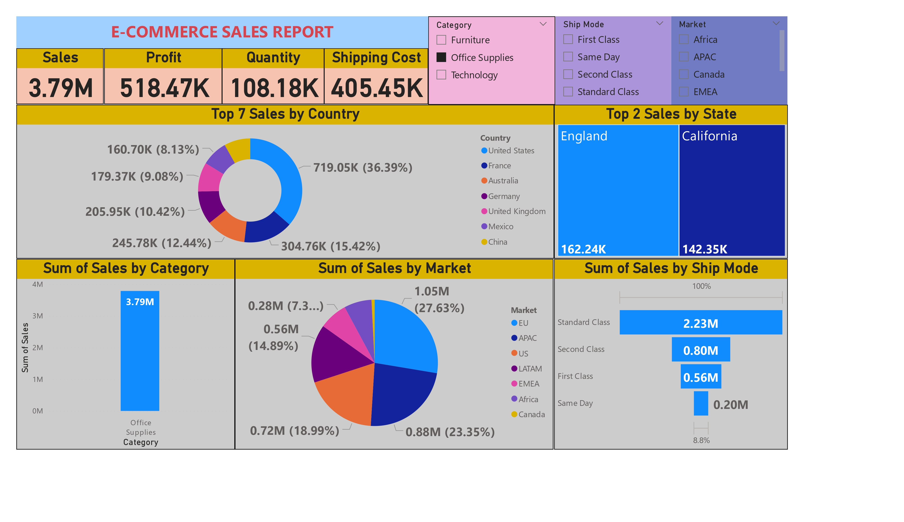

# 📊 E-Commerce Data Analysis (Power BI Dashboard)

## 🔍 Project Overview
This project presents an interactive Power BI dashboard built using e-commerce sales data. It provides insights into sales performance, profit trends, and customer behavior to support data-driven business decisions.

---

## 🚀 Key Features
- 📈 Sales and Profit Analysis
- 🌍 Region-wise Performance Insights
- 🛒 Category-wise Sales Distribution
- 🚚 Shipping Mode Analysis
- 🎯 Interactive Filters and Visualizations

---

## 🛠 Tools & Technologies
- Power BI (Data Visualization)
- Microsoft Excel (Dataset)

---

## 📁 Dataset
- E-commerce sales dataset (Excel file)

---

## 📸 Dashboard Preview

---

## 📊 Insights Gained
- Identified top-performing regions and categories  
- Analyzed profit trends across different markets  
- Evaluated shipping modes and their impact on sales  

---

## 🎯 Conclusion
This dashboard helps businesses understand sales patterns and optimize strategies for better performance and decision-making.
